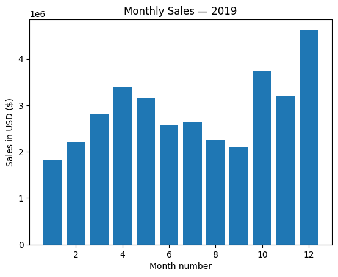
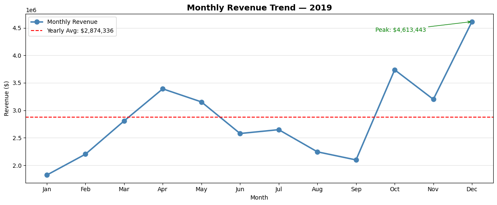
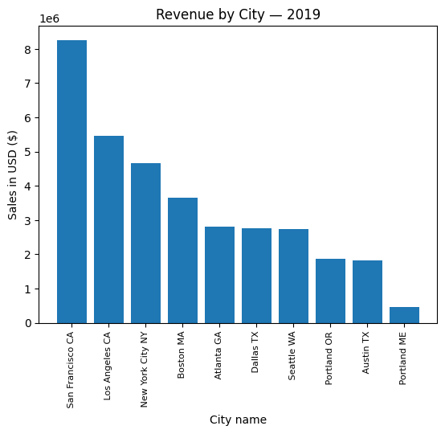
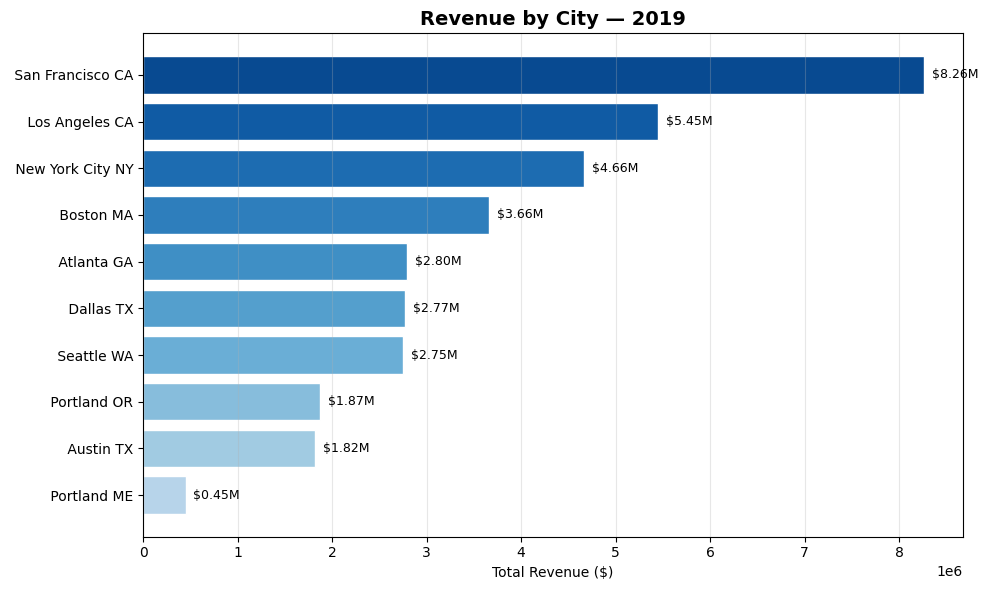
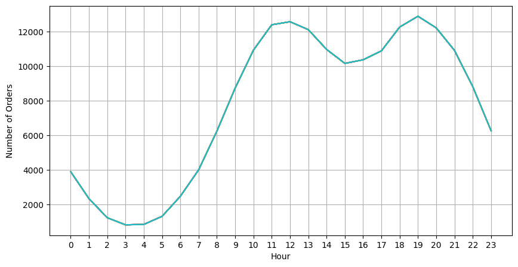
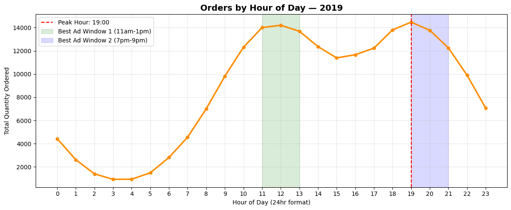
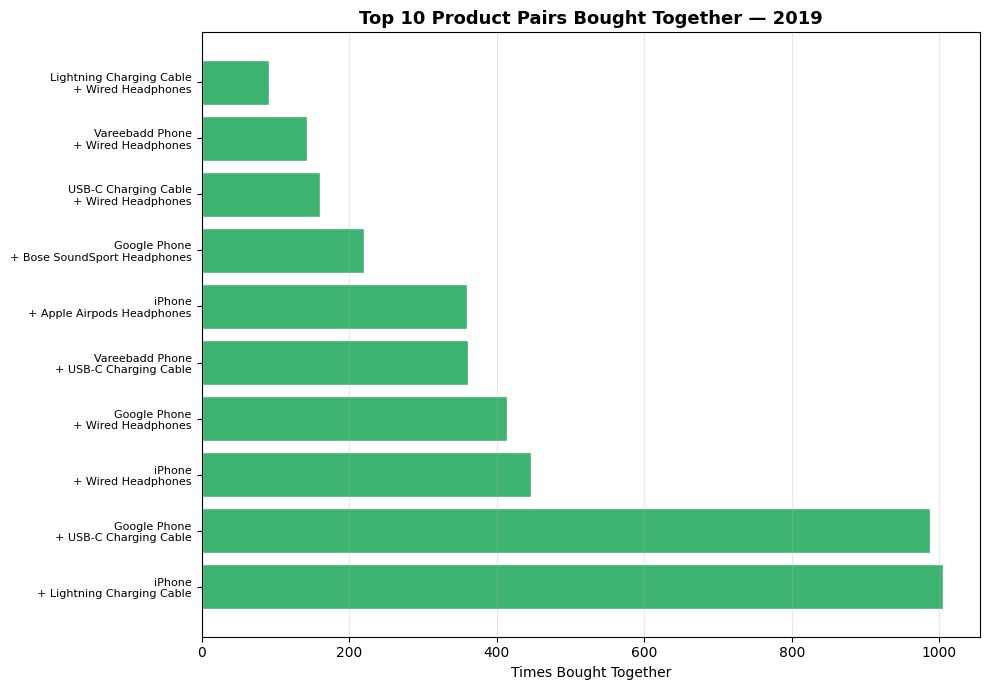
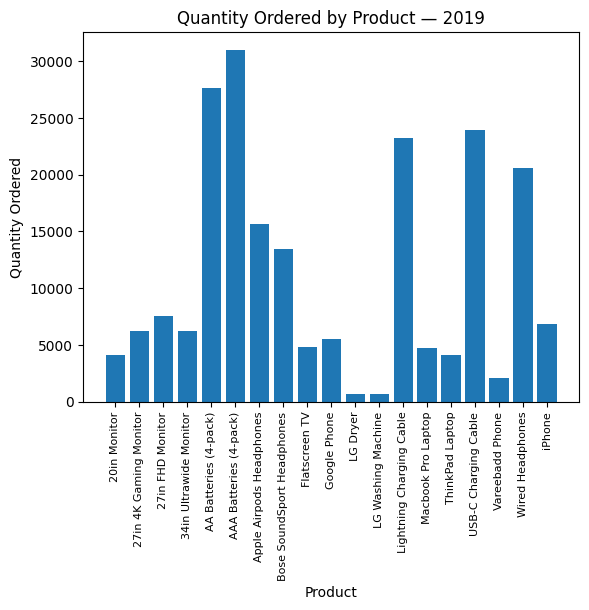
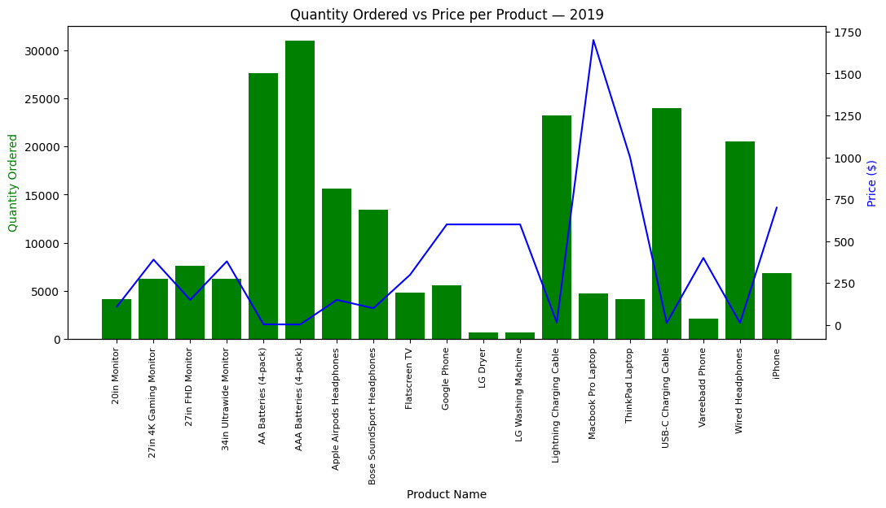

# 📊 Sales Data Visualizations & Insights

This document contains all the key graphs and visualizations extracted from the analysis, along with their descriptions.

---

### Visualization 1

### Q1.2 — Basic Bar Chart: Monthly Sales (Tutorial)

---

### Visualization 2

### Q1.4 — Enhanced Trend Chart with Average Line (Matplotlib)

---

### Visualization 3

### Q2.2 — Basic Bar Chart: City Sales (Tutorial)

---

### Visualization 4

### Q2.3 — Better Visualization: Horizontal Bar with Labels (Matplotlib)

---

### Visualization 5

### Q3.2 — Basic Line Chart: Orders by Hour (Tutorial)

---

### Visualization 6

### Q3.3 — Enhanced Chart: Mark Peak Hour + Show Ad Windows (Matplotlib + NumPy)

---

### Visualization 7

### Q4.3 — Visualize Top 10 Pairs (Matplotlib + NumPy)

---

### Visualization 8

### Q5.2 — Bar Chart: Quantity Sold per Product (Tutorial)

---

### Visualization 9

### Q5.3 — Dual Axis Chart: Quantity vs Price (Tutorial)

